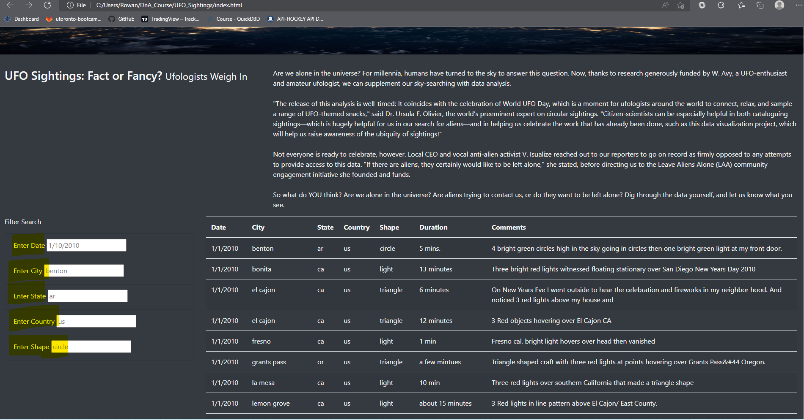

# UFO_Sightings

## Overview
  Dana is a journalist with the freedom to choose the topic she is reporting on. She chooses to report on UFO sightings because it is close to her heart. She has a larges set of data in JSON format and will use javascript to organize it neatly in a table on her html page. 

## Results
Dana can use the web app provided to sift through her JSON data and filter it with ease! By inputting parameters into the text boxes highlighted below, she will be able to pivot the display however she sees necessary!

## Summary
The draw back of this webpage is that the javascript function is built to run whenever the input value has changed. This can be tedious for someone with poor connection and is trying to run multiple filters at one time. Instead of being able to fill in multiple filter values, then run the function, they are forced to run the function every time. Some improvements that could be made to the webpage include having an export button available, allowing the user to filter on the webpage and extract the data that they need into a csv file. Another improvement is if the filters were smart enough to auto populate options that correspond as the user is typing, this would help the user know if there is data available for "toronto" as they are typing.
